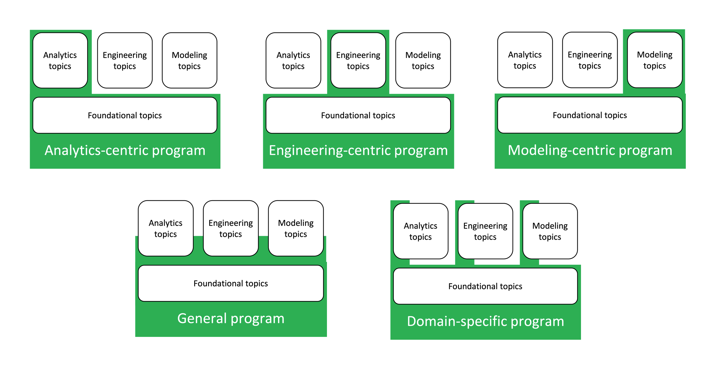

# Data science curriculum roadmap

We venture to suggest a curriculum roadmap only after receiving multiple requests. As a group, we have spent the vast majority of our time in industry, although many of us have had spent time in one academic capacity or another.  What follows is a set of broad recommendations, and it will inevitably require a lot of adjustments in each case for implementation. Given that caveat, here are our curriculum recommendations. 

### More application than theory

We want to lead by emphasizing that the single most important factor in preparing students to apply their knowledge in an industry setting is application-centric learning. Working with realistic data to answer realistic questions is their best preparation. It grounds abstract concepts in hands-on experience, and it teaches data mechanics and data intuition at the same time, something that is impossible to do in isolation. 

With that in mind, there are definitely a list of topics that prepare one well to practice data science. 

## Curriculum archetypes

The types of data science and data centric academic programs closely mirror [the major skill areas](what_DS_do.md) we identified in our work. There are programs that emphasize **engineering**, programs that emphasize **analytics**, and programs that emphasize **modeling**.  The distinction between these is that analytics focuses on the question of what can we learn from our data, modeling focuses on the problem of estimating data we wish we had, and engineering focuses on how to make it all run faster,  more efficiently, and more robustly. 

There are also **general data science programs** that cover all these areas to some degree. In addition there are quite a few **domain specific programs**, where a subset of engineering, analytics, and modeling skills specific to a given field are taught.

The curriculum recommendations for each of these program archetypes will be different. However, all of them will share a core of foundational topics. Then analytics, engineering, and modeling-centric programs will have additional topic areas of their own. A general curriculum will include some aspects of the analytics, engineering, and modeling curricula, although perhaps not to the same depth. It is common for students to self select courses from any combination of the three areas.

Curricula for domain specific programs look similar to a general program, except that topics, and even entire courses, will be focused on specific skills comment to the area. For instance, an actuarial-focused data analytics program would likely include  software tools most commonly used in insurance companies, time series and rare-event prediction algorithms, and visualization methods that are accepted throughout the insurance industry. 

Here are the major topics we suggest including in each area, with some of the particularly important subtopics enumerated.

## Foundational topics
* Programming
* Statistics
    * Probability distributions
    * Hypothesis testing 
* Algebra 

## Analytics topics
* Advanced statistics
* Statistical programming
* Calculus
* Visualization

## Engineering topics
* Software engineering
* Database design

## Modeling topics
* Machine learning methods
    * Supervised
    * Unsupervised
    * Neural networks
* Algorithm design
* Optimization 

#
Note that for each topic and subtopic, there are many effective ways to split it into courses. The best way for your institution will depend on many factors, including length of term, hours per class, existing departmental boundaries, instuctor availability, and the rate at which your students are expected to absorb information. These recommendations assume a two-year masters program with the primary goal of preparing students for employment and continued career growth, although they can certainly be scaled up or down to fit the scope of other programs.

It bears repeating that application-focused instruction will best prepare the students for professional positions. The more theory is grounded in concrete examples, and the more specific skills are exercised in the context of solving a larger problem, the deeper the student's understanding of how it works, and where to apply it. 
